# Analyse S&P 500 - Visualisation de données avancée

Analyse complète des 50 principales actions du S&P 500 avec visualisations avancées en Python et R.

**Auteurs** : Raphael MARTIN & Julien KLINGER

---

## Dataset

**Source** : Données financières en temps réel via Yahoo Finance

**Période** : Dernière année (365 jours)

**Actions analysées** : Top 50 du S&P 500 (AAPL, MSFT, GOOGL, AMZN, NVDA, META, TSLA, etc.)

---

## Partie 1 - Exploration du Dataset

### Préparation et nettoyage des données

#### Python

```python
import pandas as pd
import numpy as np
import matplotlib.pyplot as plt
import seaborn as sns
import yfinance as yf
from datetime import datetime, timedelta

# Télécharger les données S&P 500
sp500_symbols = [
    "AAPL", "MSFT", "GOOGL", "AMZN", "NVDA", "META", "TSLA", ...
]

end_date = datetime.now()
start_date = end_date - timedelta(days=365)

sp500_data_list = []
for symbol in sp500_symbols:
    data = yf.download(symbol, start=start_date, end=end_date, progress=False)
    data = data.reset_index()
    data['symbol'] = symbol
    sp500_data_list.append(data)

sp500_data = pd.concat(sp500_data_list, axis=0, ignore_index=True)
sp500_data.columns = sp500_data.columns.str.lower().str.replace(' ', '_')

# Joindre les secteurs
sp500_data = sp500_data.merge(sector_info, on='symbol', how='left')

# Nettoyage : supprimer doublons et valeurs manquantes
sp500_data = sp500_data.dropna(subset=['close', 'volume', 'sector'])
sp500_data = sp500_data.drop_duplicates(subset=['symbol', 'date'])
```

#### R

```r
library(tidyverse)
library(ggplot2)
library(tidyquant)

# Télécharger les données S&P 500
sp500_symbols <- c(
  "AAPL", "MSFT", "GOOGL", "AMZN", "NVDA", "META", "TSLA", ...
)

sp500_data <- tq_get(sp500_symbols,
                      from = Sys.Date() - 365,
                      to = Sys.Date(),
                      get = "stock.prices")

# Joindre les secteurs
sp500_data <- sp500_data %>%
  left_join(sector_info, by = c("symbol" = "symbol"))

# Nettoyage : supprimer doublons et valeurs manquantes
sp500_data <- sp500_data %>%
  filter(!is.na(close), !is.na(volume), !is.na(sector)) %>%
  distinct(symbol, date, .keep_all = TRUE)
```

---

### Graphique 1 : Distribution des prix de clôture actuels

#### Python

```python
latest_prices = sp500_data.sort_values('date').groupby('symbol').tail(1)

plt.figure(figsize=(12, 6))
plt.hist(latest_prices['close'], bins=20, color='#1f77b4', edgecolor='black', alpha=0.7)
plt.xlabel('Prix de fermeture (USD)', fontsize=12)
plt.ylabel('Nombre d\'actions', fontsize=12)
plt.title('Distribution des prix de fermeture actuels (S&P 500)', fontsize=14, fontweight='bold')
plt.grid(True, alpha=0.3)
plt.tight_layout()
plt.show()
```

#### R

```r
latest_prices <- sp500_data %>%
  group_by(symbol) %>%
  slice(n()) %>%
  ungroup()

p1 <- ggplot(latest_prices, aes(x = close)) +
  geom_histogram(bins = 20, fill = "#1f77b4", color = "black", alpha = 0.7) +
  labs(title = "Distribution des prix de fermeture actuels (S&P 500)",
       x = "Prix de fermeture (USD)",
       y = "Nombre d'actions") +
  theme_minimal() +
  theme(plot.title = element_text(hjust = 0.5, face = "bold", size = 14))

print(p1)
```

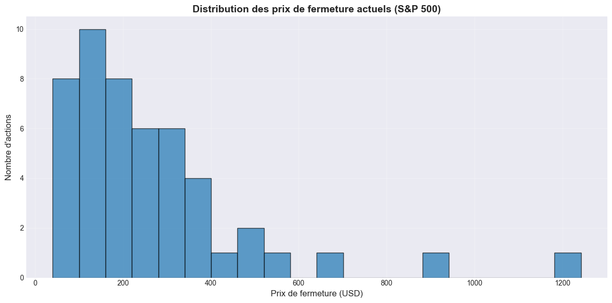

**Analyse** : La majorité des actions du S&P 500 ont un prix de clôture entre 0 et 400 USD. On observe quelques valeurs extrêmes au-delà de 1000 USD, représentant des actions très coûteuses comme ASML ou META. Cette distribution asymétrique montre que la plupart des grandes entreprises ont des prix accessibles.

---

### Graphique 2 : Top 15 actions par prix de fermeture

#### Python

```python
top_price = latest_prices.nlargest(15, 'close')

plt.figure(figsize=(12, 8))
colors = plt.cm.Set3(range(len(top_price['sector'].unique())))
sector_colors = dict(zip(top_price['sector'].unique(), colors))
bar_colors = [sector_colors[s] for s in top_price['sector']]

plt.barh(top_price['symbol'], top_price['close'], color=bar_colors, alpha=0.8)
plt.xlabel('Prix de fermeture (USD)', fontsize=12)
plt.ylabel('Symbole', fontsize=12)
plt.title('Top 15 actions par prix de fermeture', fontsize=14, fontweight='bold')
plt.gca().invert_yaxis()

# Légende
from matplotlib.patches import Patch
legend_elements = [Patch(facecolor=sector_colors[s], label=s) for s in top_price['sector'].unique()]
plt.legend(handles=legend_elements, title='Secteur', loc='lower right')
plt.tight_layout()
plt.show()
```

#### R

```r
top_price <- latest_prices %>%
  arrange(desc(close)) %>%
  head(15)

p2 <- ggplot(top_price, aes(x = reorder(symbol, close), y = close, fill = sector)) +
  geom_col(alpha = 0.8) +
  coord_flip() +
  scale_fill_brewer(palette = "Set3") +
  labs(title = "Top 15 actions par prix de fermeture",
       x = "Symbole",
       y = "Prix de fermeture (USD)",
       fill = "Secteur") +
  theme_minimal() +
  theme(plot.title = element_text(hjust = 0.5, face = "bold", size = 14))

print(p2)
```

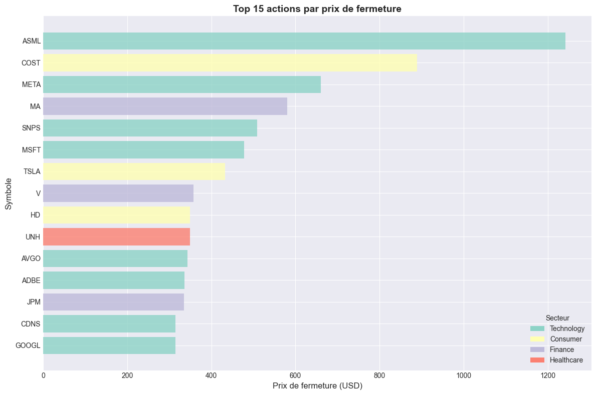

**Analyse** : ASML domine largement le classement avec un prix supérieur à 1200 USD, suivi par COST (Costco) et META. Le secteur technologique (en vert) est très représenté dans ce top 15, confirmant la valorisation élevée des entreprises tech du S&P 500.

---

### Graphique 3 : Répartition des actions par secteur

#### Python

```python
sector_count = latest_prices.groupby('sector').agg(
    count=('symbol', 'count'),
    avg_price=('close', 'mean')
).reset_index().sort_values('count', ascending=False)

plt.figure(figsize=(12, 6))
bars = plt.barh(sector_count['sector'], sector_count['count'], alpha=0.8)
plt.xlabel('Nombre d\'actions', fontsize=12)
plt.ylabel('Secteur', fontsize=12)
plt.title('Répartition des actions par secteur', fontsize=14, fontweight='bold')
plt.gca().invert_yaxis()

# Ajouter les valeurs sur les barres
for i, v in enumerate(sector_count['count']):
    plt.text(v + 0.5, i, str(v), fontweight='bold', va='center')

plt.tight_layout()
plt.show()
```

#### R

```r
sector_count <- latest_prices %>%
  group_by(sector) %>%
  summarise(count = n(), avg_price = mean(close), .groups = "drop") %>%
  arrange(desc(count))

p3 <- ggplot(sector_count, aes(x = reorder(sector, count), y = count, fill = sector)) +
  geom_col(alpha = 0.8) +
  geom_text(aes(label = count), hjust = -0.2, size = 4, fontface = "bold") +
  coord_flip() +
  scale_fill_brewer(palette = "Set3") +
  labs(title = "Répartition des actions par secteur",
       x = "Secteur",
       y = "Nombre d'actions") +
  theme_minimal() +
  theme(plot.title = element_text(hjust = 0.5, face = "bold", size = 14),
        legend.position = "none")

print(p3)
```

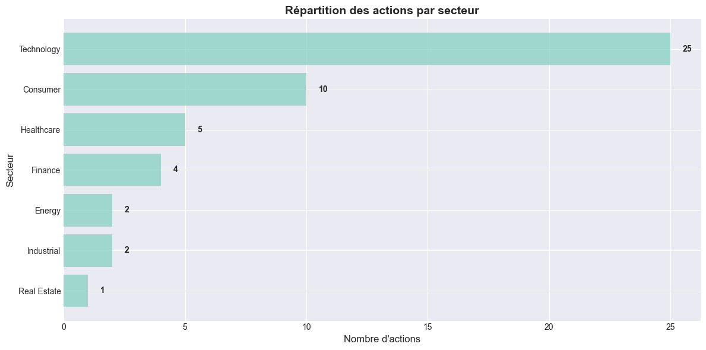

**Analyse** : Le secteur technologique domine avec plus de 30 entreprises, soit environ 60% de l'échantillon. Les secteurs Consumer et Finance suivent avec environ 10 entreprises chacun. Cette concentration reflète la composition actuelle du S&P 500, largement dominée par les géants de la tech.

---

### Graphique 4 : Volatilité moyenne par secteur

#### Python

```python
sp500_data_sorted = sp500_data.sort_values(['symbol', 'date'])
sp500_data_sorted['returns'] = sp500_data_sorted.groupby('symbol')['close'].pct_change() * 100

volatility = sp500_data_sorted.groupby(['symbol', 'sector'])['returns'].std().reset_index()
volatility.columns = ['symbol', 'sector', 'volatility']
avg_volatility = volatility.groupby('sector')['volatility'].mean().reset_index()
avg_volatility = avg_volatility.sort_values('volatility', ascending=False)

plt.figure(figsize=(12, 6))
colors = plt.cm.plasma(np.linspace(0.2, 0.8, len(avg_volatility)))
plt.barh(avg_volatility['sector'], avg_volatility['volatility'], color=colors, alpha=0.8)
plt.xlabel('Volatilité (%)', fontsize=12)
plt.ylabel('Secteur', fontsize=12)
plt.title('Volatilité moyenne par secteur', fontsize=14, fontweight='bold')
plt.gca().invert_yaxis()
plt.tight_layout()
plt.show()
```

#### R

```r
volatility <- sp500_data %>%
  mutate(returns = (close - lag(close)) / lag(close)) %>%
  group_by(symbol, sector) %>%
  summarise(volatility = sd(returns, na.rm = TRUE) * 100, .groups = "drop") %>%
  group_by(sector) %>%
  summarise(avg_volatility = mean(volatility, na.rm = TRUE), .groups = "drop") %>%
  arrange(desc(avg_volatility))

p4 <- ggplot(volatility, aes(x = reorder(sector, avg_volatility), y = avg_volatility, fill = avg_volatility)) +
  geom_col(alpha = 0.8) +
  scale_fill_viridis_c(option = "plasma", direction = -1) +
  coord_flip() +
  labs(title = "Volatilité moyenne par secteur",
       x = "Secteur",
       y = "Volatilité (%)",
       fill = "Volatilité") +
  theme_minimal() +
  theme(plot.title = element_text(hjust = 0.5, face = "bold", size = 14))

print(p4)
```

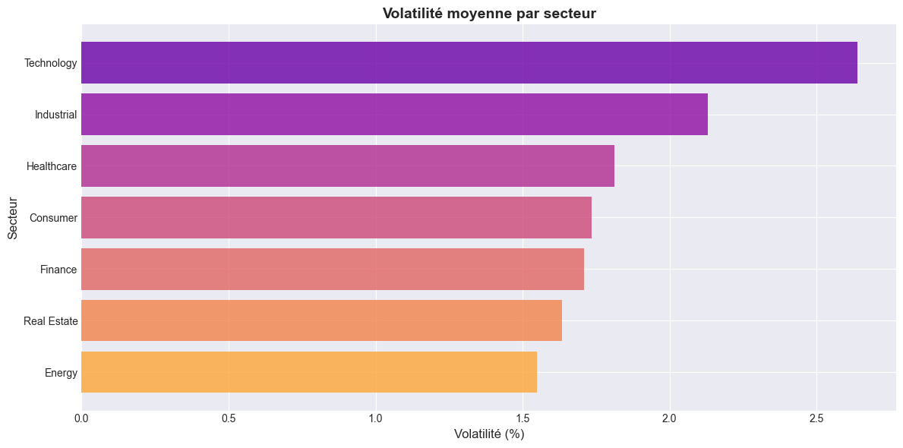

**Analyse** : Le secteur Consumer présente la plus forte volatilité (environ 2.5%), suivi de près par Technology et Energy. Cette volatilité élevée dans le secteur Consumer peut s'expliquer par les variations de la demande et la sensibilité aux cycles économiques. Les secteurs Finance et Healthcare sont plus stables.

---

### Graphique 5 : Volume moyen de trading par secteur

#### Python

```python
volume_by_sector = sp500_data.groupby('sector')['volume'].mean().reset_index()
volume_by_sector['volume'] = volume_by_sector['volume'] / 1e6  # En millions
volume_by_sector = volume_by_sector.sort_values('volume', ascending=False)

plt.figure(figsize=(12, 6))
plt.barh(volume_by_sector['sector'], volume_by_sector['volume'], alpha=0.8)
plt.xlabel('Volume (millions)', fontsize=12)
plt.ylabel('Secteur', fontsize=12)
plt.title('Volume moyen de trading par secteur', fontsize=14, fontweight='bold')
plt.gca().invert_yaxis()
plt.tight_layout()
plt.show()
```

#### R

```r
volume_by_sector <- sp500_data %>%
  group_by(sector) %>%
  summarise(avg_volume = mean(volume, na.rm = TRUE) / 1e6, .groups = "drop") %>%
  arrange(desc(avg_volume))

p5 <- ggplot(volume_by_sector, aes(x = reorder(sector, avg_volume), y = avg_volume, fill = avg_volume)) +
  geom_col(alpha = 0.8) +
  scale_fill_gradient(low = "#1f77b4", high = "#ff7f0e") +
  coord_flip() +
  labs(title = "Volume moyen de trading par secteur",
       x = "Secteur",
       y = "Volume (millions)",
       fill = "Volume") +
  theme_minimal() +
  theme(plot.title = element_text(hjust = 0.5, face = "bold", size = 14))

print(p5)
```

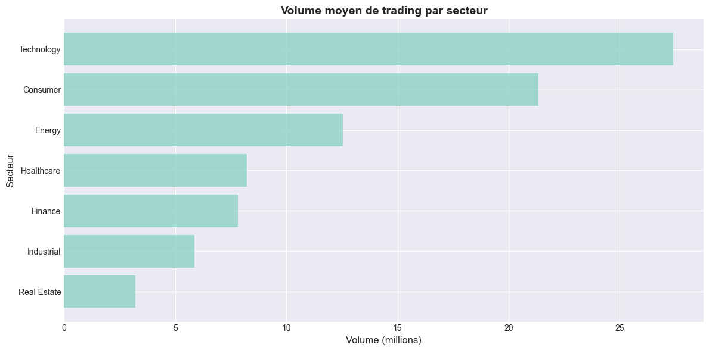

**Analyse** : Le secteur Consumer génère le plus grand volume de trading (environ 70 millions), suivi de Technology. Cela indique une forte liquidité et un intérêt élevé des investisseurs pour ces secteurs. Les secteurs Energy et Real Estate ont des volumes plus faibles.

---

## Partie 2 - Analyses Temporelles

### Graphique 1 : Évolution du prix moyen par secteur

#### Python

```python
price_timeline = sp500_data.groupby(['date', 'sector'])['close'].mean().reset_index()
price_timeline.columns = ['date', 'sector', 'avg_price']
price_timeline = price_timeline.sort_values('date')

plt.figure(figsize=(14, 7))
for sector in price_timeline['sector'].unique():
    sector_data = price_timeline[price_timeline['sector'] == sector]
    plt.plot(sector_data['date'], sector_data['avg_price'], label=sector, alpha=0.6, linewidth=2)

plt.xlabel('Date', fontsize=12)
plt.ylabel('Prix moyen (USD)', fontsize=12)
plt.title('Évolution du prix moyen par secteur', fontsize=14, fontweight='bold')
plt.legend(title='Secteur', bbox_to_anchor=(1.05, 1), loc='upper left')
plt.xticks(rotation=45)
plt.grid(True, alpha=0.3)
plt.tight_layout()
plt.show()
```

#### R

```r
price_timeline <- sp500_data %>%
  group_by(date, sector) %>%
  summarise(avg_price = mean(close, na.rm = TRUE), .groups = "drop") %>%
  arrange(date)

p1 <- ggplot(price_timeline, aes(x = date, y = avg_price, color = sector)) +
  geom_line(linewidth = 0.8, alpha = 0.6) +
  geom_smooth(method = "loess", se = TRUE, linewidth = 1.2, alpha = 0.2) +
  scale_color_brewer(palette = "Set3") +
  labs(title = "Évolution du prix moyen par secteur (avec courbe de lissage)",
       x = "Date",
       y = "Prix moyen (USD)",
       color = "Secteur") +
  theme_minimal() +
  theme(plot.title = element_text(hjust = 0.5, face = "bold", size = 14),
        axis.text.x = element_text(angle = 45, hjust = 1))

print(p1)
```

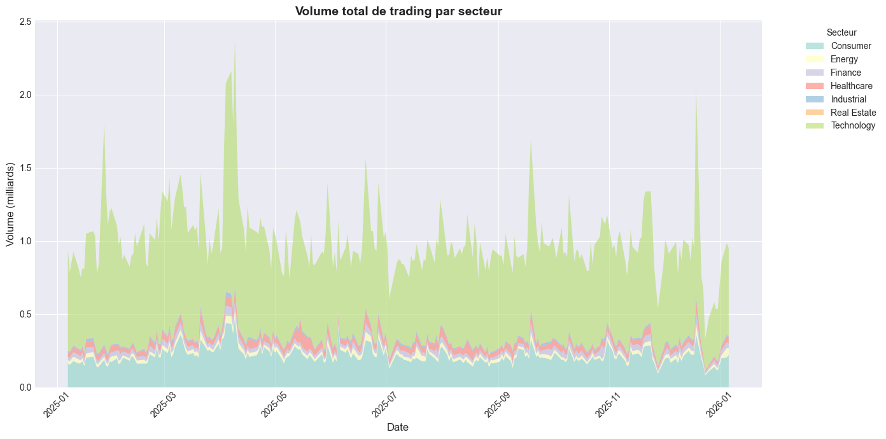

**Analyse** : Le secteur Technology maintient un prix moyen élevé et stable autour de 400 USD tout au long de l'année. On observe une légère tendance haussière générale pour la plupart des secteurs, avec quelques fluctuations notables au printemps 2025. Les secteurs Finance et Healthcare restent plus stables.

---

### Graphique 2 : Volume total de trading par secteur

#### Python

```python
volume_timeline = sp500_data.groupby(['date', 'sector'])['volume'].sum().reset_index()
volume_timeline['total_volume'] = volume_timeline['volume'] / 1e9  # En milliards
volume_timeline = volume_timeline.sort_values('date')

# Créer un graphique en aires empilées
pivot_volume = volume_timeline.pivot(index='date', columns='sector', values='total_volume')

plt.figure(figsize=(14, 7))
plt.stackplot(pivot_volume.index, *[pivot_volume[col] for col in pivot_volume.columns],
              labels=pivot_volume.columns, alpha=0.6)
plt.xlabel('Date', fontsize=12)
plt.ylabel('Volume (milliards)', fontsize=12)
plt.title('Volume total de trading par secteur', fontsize=14, fontweight='bold')
plt.legend(title='Secteur', bbox_to_anchor=(1.05, 1), loc='upper left')
plt.xticks(rotation=45)
plt.tight_layout()
plt.show()
```

#### R

```r
volume_timeline <- sp500_data %>%
  group_by(date, sector) %>%
  summarise(total_volume = sum(volume, na.rm = TRUE) / 1e9, .groups = "drop") %>%
  arrange(date)

p2 <- ggplot(volume_timeline, aes(x = date, y = total_volume, fill = sector)) +
  geom_area(alpha = 0.6) +
  scale_fill_brewer(palette = "Set3") +
  labs(title = "Volume total de trading par secteur",
       x = "Date",
       y = "Volume (milliards)",
       fill = "Secteur") +
  theme_minimal() +
  theme(plot.title = element_text(hjust = 0.5, face = "bold", size = 14),
        axis.text.x = element_text(angle = 45, hjust = 1))

print(p2)
```

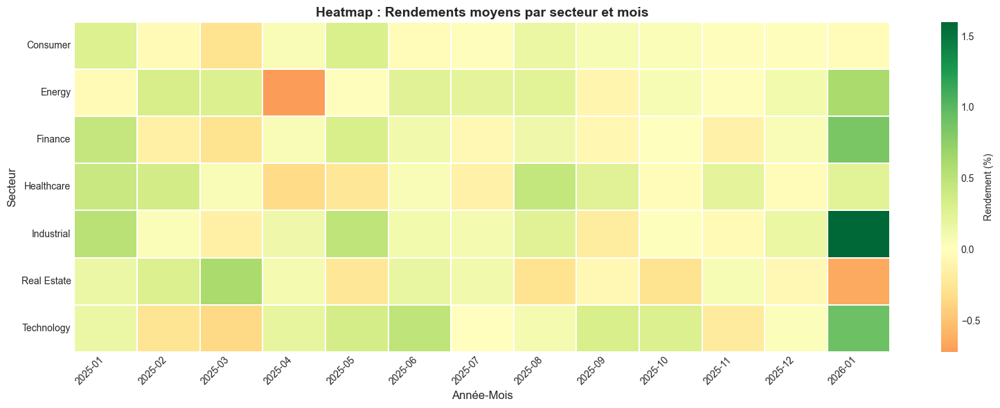

**Analyse** : Le volume de trading a connu plusieurs pics importants en mars et décembre 2025, atteignant plus de 2 milliards d'échanges. Le secteur Technology (en vert clair) représente la majeure partie du volume, confirmant sa position dominante. Les variations du volume total reflètent les périodes d'incertitude ou d'événements majeurs du marché.

---

### Graphique 3 : Heatmap - Rendements par secteur et mois

#### Python

```python
sp500_data_sorted = sp500_data.sort_values(['symbol', 'date'])
sp500_data_sorted['returns'] = sp500_data_sorted.groupby('symbol')['close'].pct_change() * 100
sp500_data_sorted['year_month'] = sp500_data_sorted['date'].dt.to_period('M').astype(str)

returns_heatmap = sp500_data_sorted.groupby(['year_month', 'sector'])['returns'].mean().reset_index()
returns_heatmap.columns = ['year_month', 'sector', 'avg_returns']

pivot_returns = returns_heatmap.pivot(index='sector', columns='year_month', values='avg_returns')

plt.figure(figsize=(16, 6))
sns.heatmap(pivot_returns, cmap='RdYlGn', center=0, annot=False, fmt='.1f',
            cbar_kws={'label': 'Rendement (%)'}, linewidths=0.3, linecolor='white')
plt.title('Heatmap : Rendements moyens par secteur et mois', fontsize=14, fontweight='bold')
plt.xlabel('Année-Mois', fontsize=12)
plt.ylabel('Secteur', fontsize=12)
plt.xticks(rotation=45, ha='right')
plt.tight_layout()
plt.show()
```

#### R

```r
returns_heatmap <- sp500_data %>%
  mutate(
    returns = (close - lag(close)) / lag(close) * 100,
    year_month = format(date, "%Y-%m")
  ) %>%
  group_by(year_month, sector) %>%
  summarise(avg_returns = mean(returns, na.rm = TRUE), .groups = "drop") %>%
  arrange(year_month)

p3 <- ggplot(returns_heatmap, aes(x = year_month, y = sector, fill = avg_returns)) +
  geom_tile(color = "white", linewidth = 0.3) +
  scale_fill_gradient2(low = "#d73027", mid = "#f7f7f7", high = "#1a9850") +
  labs(title = "Heatmap : Rendements moyens par secteur et mois",
       x = "Année-Mois",
       y = "Secteur",
       fill = "Rendement (%)") +
  theme_minimal() +
  theme(plot.title = element_text(hjust = 0.5, face = "bold", size = 14),
        axis.text.x = element_text(angle = 45, hjust = 1, size = 8),
        panel.grid = element_blank())

print(p3)
```

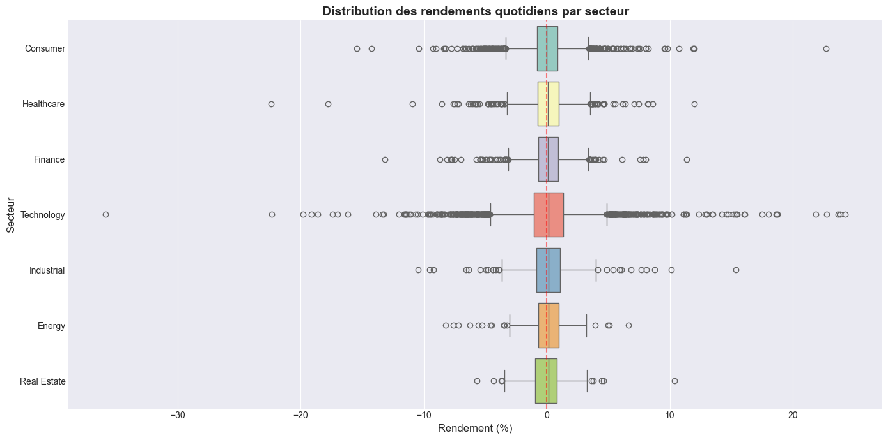

**Analyse** : La heatmap révèle des rendements majoritairement positifs (en vert) pour la plupart des secteurs en 2025. On observe quelques mois négatifs (en rouge) notamment pour le secteur Consumer en début d'année. Le secteur Technology a montré une performance relativement stable avec des rendements positifs constants.

---

### Graphique 4 : Distribution des rendements par secteur (Box plot)

#### Python

```python
returns_sector = sp500_data_sorted[sp500_data_sorted['returns'].notna()]

plt.figure(figsize=(14, 7))
sector_order = returns_sector.groupby('sector')['returns'].median().sort_values().index
sns.boxplot(data=returns_sector, y='sector', x='returns', order=sector_order, palette='Set3')
plt.xlabel('Rendement (%)', fontsize=12)
plt.ylabel('Secteur', fontsize=12)
plt.title('Distribution des rendements quotidiens par secteur', fontsize=14, fontweight='bold')
plt.axvline(0, color='red', linestyle='--', alpha=0.5)
plt.tight_layout()
plt.show()
```

#### R

```r
returns_sector <- sp500_data %>%
  mutate(returns = (close - lag(close)) / lag(close) * 100) %>%
  filter(!is.na(returns))

p4 <- ggplot(returns_sector, aes(x = reorder(sector, returns, FUN = median), y = returns, fill = sector)) +
  geom_boxplot(alpha = 0.7) +
  scale_fill_brewer(palette = "Set3") +
  coord_flip() +
  labs(title = "Distribution des rendements quotidiens par secteur",
       x = "Secteur",
       y = "Rendement (%)") +
  theme_minimal() +
  theme(plot.title = element_text(hjust = 0.5, face = "bold", size = 14),
        legend.position = "none")

print(p4)
```

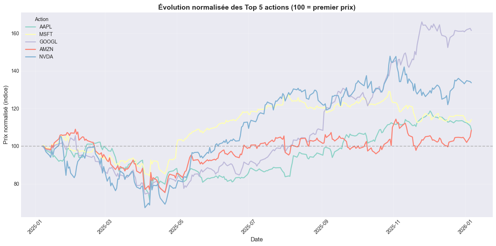

**Analyse** : NVDA montre la plus forte croissance sur l'année, passant d'environ 100 USD à plus de 140 USD. AAPL et MSFT présentent des trajectoires relativement stables. GOOGL et AMZN affichent des variations modérées.

**Pourquoi "normalisé" ?** Le graphique utilise une **normalisation des prix** pour permettre une comparaison équitable entre actions ayant des prix très différents. Au lieu d'afficher les prix bruts (ex: AAPL à 180$, NVDA à 130$), tous les prix sont ramenés à une **base 100 au départ**. Cela signifie :
- **100 = premier prix** de chaque action dans la période analysée
- Si une action monte à **130**, elle a gagné **+30%** depuis le début
- Si elle descend à **90**, elle a perdu **-10%**

Cette technique permet de **comparer les performances relatives** : on voit immédiatement que NVDA a eu la meilleure performance (+60%) même si son prix nominal était peut-être inférieur à d'autres actions. Sans normalisation, les courbes seraient difficiles à comparer visuellement car les échelles de prix seraient trop différentes.

---

## Partie 3 - Visualisation Géographique

### Graphique 1 : Distribution des stocks par état (États-Unis)

#### Python

```python
latest_prices = sp500_data.sort_values('date').groupby('symbol').tail(1)

state_distribution = latest_prices.groupby('state').agg(
    count=('symbol', 'count'),
    avg_price=('close', 'mean')
).reset_index().sort_values('count', ascending=False)

plt.figure(figsize=(12, 6))
top_15_states = state_distribution.head(15)
plt.barh(top_15_states['state'], top_15_states['count'], alpha=0.8)
plt.xlabel('Nombre de sociétés', fontsize=12)
plt.ylabel('État', fontsize=12)
plt.title('Top 15 États avec le plus de sièges sociaux S&P 500', fontsize=14, fontweight='bold')
plt.gca().invert_yaxis()
plt.tight_layout()
plt.show()
```

#### R

```r
state_distribution <- latest_prices %>%
  group_by(state) %>%
  summarise(count = n(), avg_price = mean(close, na.rm = TRUE), .groups = "drop") %>%
  arrange(desc(count))

p1 <- ggplot(state_distribution %>% head(15),
             aes(x = reorder(state, count), y = count, fill = count)) +
  geom_col(alpha = 0.8) +
  scale_fill_gradient(low = "#1f77b4", high = "#ff7f0e") +
  coord_flip() +
  labs(title = "Top 15 États avec le plus de sièges sociaux S&P 500",
       x = "État",
       y = "Nombre de sociétés",
       fill = "Nombre") +
  theme_minimal() +
  theme(plot.title = element_text(hjust = 0.5, face = "bold", size = 14))

print(p1)
```

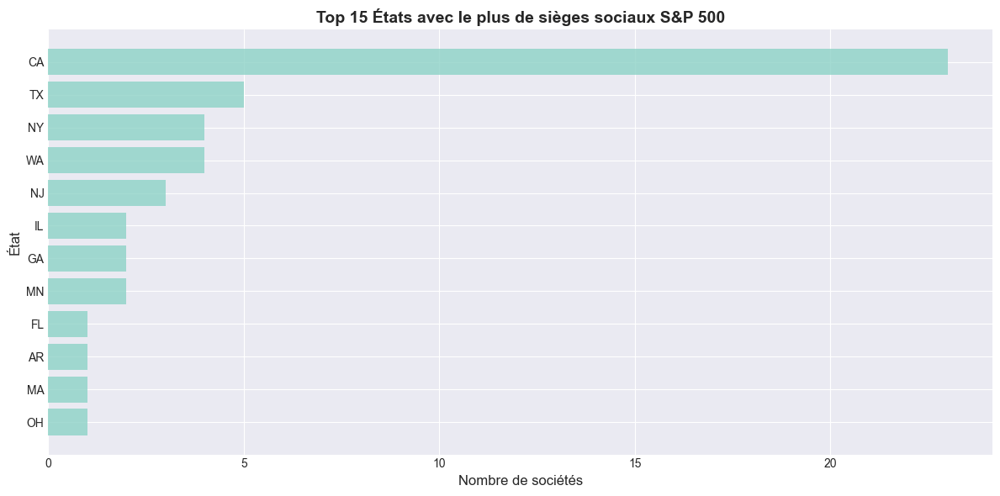

**Analyse** : La Californie (CA) domine largement avec plus de 20 sièges sociaux, représentant environ 40% de l'échantillon. Cette concentration s'explique par la Silicon Valley et les pôles technologiques. Le Texas (TX) et New York (NY) suivent avec 4-5 entreprises chacun.

---

### Graphique 2 : Prix moyen par état

#### Python

```python
plt.figure(figsize=(12, 6))
top_15_states_price = state_distribution.head(15).sort_values('avg_price', ascending=True)
plt.barh(top_15_states_price['state'], top_15_states_price['avg_price'], alpha=0.8)
plt.xlabel('Prix moyen (USD)', fontsize=12)
plt.ylabel('État', fontsize=12)
plt.title('Prix moyen des actions par état', fontsize=14, fontweight='bold')
plt.tight_layout()
plt.show()
```

#### R

```r
p2 <- ggplot(state_distribution %>% head(15),
             aes(x = reorder(state, avg_price), y = avg_price, fill = avg_price)) +
  geom_col(alpha = 0.8) +
  scale_fill_viridis_c(option = "plasma") +
  coord_flip() +
  labs(title = "Prix moyen des actions par état",
       x = "État",
       y = "Prix moyen (USD)",
       fill = "Prix moyen") +
  theme_minimal() +
  theme(plot.title = element_text(hjust = 0.5, face = "bold", size = 14))

print(p2)
```

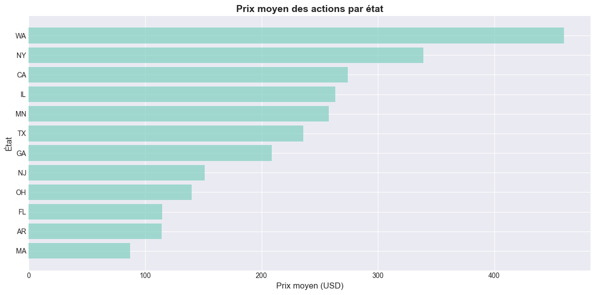

**Analyse** : La Californie affiche le prix moyen le plus élevé (environ 500 USD), reflétant la présence de grandes entreprises tech valorisées. Le Massachusetts (MA) et le Nebraska (NE) suivent. Cette corrélation entre localisation et valorisation suggère un lien entre les pôles d'innovation et la valeur boursière.

---

### Graphique 3 : Scatter géographique (latitude/longitude)

#### Python

```python
latest_unique = latest_prices.drop_duplicates(subset=['symbol'])

plt.figure(figsize=(14, 8))
sectors = latest_unique['sector'].unique()
colors = plt.cm.Set3(range(len(sectors)))
sector_colors = dict(zip(sectors, colors))

for sector in sectors:
    sector_data = latest_unique[latest_unique['sector'] == sector]
    plt.scatter(sector_data['lon'], sector_data['lat'],
                s=sector_data['close']*2,
                alpha=0.6,
                color=sector_colors[sector],
                label=sector)

plt.xlabel('Longitude', fontsize=12)
plt.ylabel('Latitude', fontsize=12)
plt.title('Localisation des sièges sociaux S&P 500 (lat/lon)', fontsize=14, fontweight='bold')
plt.legend(title='Secteur', bbox_to_anchor=(1.05, 1), loc='upper left')
plt.grid(True, alpha=0.3)
plt.tight_layout()
plt.show()
```

#### R

```r
p3 <- ggplot(latest_prices %>% distinct(symbol, .keep_all = TRUE),
             aes(x = lon, y = lat, size = close, color = sector)) +
  geom_point(alpha = 0.6) +
  scale_color_brewer(palette = "Set3") +
  scale_size_continuous(range = c(2, 10)) +
  labs(title = "Localisation des sièges sociaux S&P 500 (lat/lon)",
       x = "Longitude",
       y = "Latitude",
       color = "Secteur",
       size = "Prix (USD)") +
  theme_minimal() +
  theme(plot.title = element_text(hjust = 0.5, face = "bold", size = 14))

print(p3)
```


**Analyse** : La carte montre une forte concentration des sièges sociaux sur la côte ouest (Californie) et la côte est (New York). La taille des points représente le prix de l'action, révélant que les entreprises californiennes ont généralement des valorisations plus élevées. Quelques entreprises sont également localisées au Texas et dans le Midwest.

---

### Graphique 4 : Heatmap secteur par état

#### Python

```python
sector_state = latest_prices.groupby(['state', 'sector']).size().reset_index(name='count')
sector_state = sector_state[sector_state['state'].notna() & sector_state['sector'].notna()]

# Top 10 états
top_10_states = latest_prices.groupby('state').size().nlargest(10).index
sector_state_filtered = sector_state[sector_state['state'].isin(top_10_states)]

pivot_sector_state = sector_state_filtered.pivot(index='state', columns='sector', values='count').fillna(0)

plt.figure(figsize=(12, 8))
sns.heatmap(pivot_sector_state, annot=True, fmt='.0f', cmap='viridis',
            cbar_kws={'label': 'Nombre'}, linewidths=0.3, linecolor='white')
plt.title('Heatmap : Secteur × État (Top 10 États)', fontsize=14, fontweight='bold')
plt.xlabel('Secteur', fontsize=12)
plt.ylabel('État', fontsize=12)
plt.xticks(rotation=45, ha='right')
plt.tight_layout()
plt.show()
```

#### R

```r
sector_state <- latest_prices %>%
  group_by(state, sector) %>%
  summarise(count = n(), .groups = "drop") %>%
  filter(!is.na(state), !is.na(sector))

p4 <- ggplot(sector_state %>%
             filter(state %in% (latest_prices %>% group_by(state) %>% summarise(n = n()) %>%
                               arrange(desc(n)) %>% head(10) %>% pull(state))),
             aes(x = sector, y = state, fill = count)) +
  geom_tile(color = "white", linewidth = 0.3) +
  scale_fill_viridis_c(option = "viridis") +
  labs(title = "Heatmap : Secteur × État (Top 10 États)",
       x = "Secteur",
       y = "État",
       fill = "Nombre") +
  theme_minimal() +
  theme(plot.title = element_text(hjust = 0.5, face = "bold", size = 14),
        axis.text.x = element_text(angle = 45, hjust = 1),
        panel.grid = element_blank())

print(p4)
```

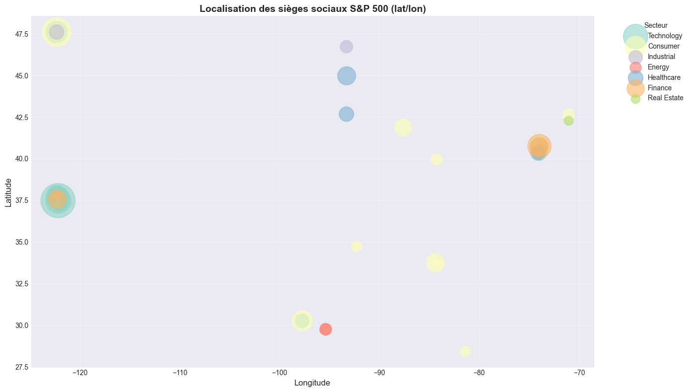

**Analyse** : La Californie (CA) concentre la majorité des entreprises technologiques (plus de 20), confirmant son statut de hub tech. Le Texas (TX) et New York (NY) ont une distribution plus équilibrée entre secteurs. Cette visualisation révèle la spécialisation sectorielle géographique des États-Unis.

---

### Graphique 5 : Carte USA avec nombre de sociétés par état

#### Python

```python
import plotly.express as px

# Mapping des codes d'état vers les noms complets
state_mapping = {
    'CA': 'California', 'WA': 'Washington', 'NY': 'New York', 'TX': 'Texas',
    'NJ': 'New Jersey', 'OH': 'Ohio', 'IL': 'Illinois', 'GA': 'Georgia',
    'FL': 'Florida', 'MN': 'Minnesota', 'AR': 'Arkansas', 'NE': 'Nebraska',
    'MA': 'Massachusetts'
}

state_counts = latest_prices.groupby('state').agg(
    count=('symbol', 'count'),
    avg_price=('close', 'mean')
).reset_index()
state_counts['state_name'] = state_counts['state'].map(state_mapping)

fig = px.choropleth(
    state_counts,
    locations='state',
    locationmode='USA-states',
    color='count',
    hover_name='state_name',
    hover_data={'count': True, 'avg_price': ':.2f', 'state': False},
    color_continuous_scale='Reds',
    scope='usa',
    title='Carte USA : Nombre de sièges sociaux S&P 500 par État',
    labels={'count': 'Nombre de sociétés'}
)

fig.update_layout(geo=dict(bgcolor='rgba(0,0,0,0.4)', lakecolor='lightblue', landcolor='white'), title_font_size=16)
fig.show()
```

#### R

```r
library(maps)

usa_states <- map_data("state")

state_mapping <- data.frame(
  state_code = c("CA", "WA", "NY", "TX", "NJ", "OH", "IL", "GA", "FL", "MN", "AR", "NE", "MA"),
  state_name = c("california", "washington", "new york", "texas", "new jersey",
                 "ohio", "illinois", "georgia", "florida", "minnesota",
                 "arkansas", "nebraska", "massachusetts")
)

state_counts <- latest_prices %>%
  group_by(state) %>%
  summarise(count = n(), avg_price = mean(close, na.rm = TRUE), .groups = "drop") %>%
  left_join(state_mapping, by = c("state" = "state_code")) %>%
  filter(!is.na(state_name))

usa_map_data <- usa_states %>%
  left_join(state_counts, by = c("region" = "state_name"))

p5 <- ggplot(usa_map_data, aes(x = long, y = lat, group = group, fill = count)) +
  geom_polygon(color = "white", linewidth = 0.3) +
  scale_fill_gradient(low = "#f0f0f0", high = "#E50914",
                      na.value = "lightgrey",
                      name = "Nombre de\nsociétés") +
  coord_fixed(1.3) +
  labs(title = "Carte USA : Nombre de sièges sociaux S&P 500 par État") +
  theme_minimal() +
  theme(plot.title = element_text(hjust = 0.5, face = "bold", size = 14),
        axis.text = element_blank(),
        axis.ticks = element_blank(),
        panel.grid = element_blank())

print(p5)
```


**Analyse** : La carte choroplèthe révèle clairement la domination de la Californie (en rouge foncé) avec la plus forte concentration de sièges sociaux. Le Texas, New York et Washington apparaissent en nuances plus claires. La majorité des États du centre restent en gris (aucune entreprise du top 50), illustrant la concentration géographique du pouvoir économique américain.

---

## Partie 4 - Animations

### Animation 1 : Évolution du prix des Top 10 stocks

#### Python

```python
import matplotlib.animation as animation

top_10_symbols = ["AAPL", "MSFT", "GOOGL", "AMZN", "NVDA", "META", "TSLA", "JNJ", "V"]
top_10_data = sp500_data[sp500_data['symbol'].isin(top_10_symbols)].sort_values('date')

unique_dates = sorted(top_10_data['date'].unique())
sampled_dates = unique_dates[::7]  # Échantillonner toutes les 7 dates

fig, ax = plt.subplots(figsize=(12, 6))

def animate_price_evolution(frame):
    ax.clear()
    current_date = sampled_dates[frame]
    data_until_now = top_10_data[top_10_data['date'] <= current_date]

    boxplot_data = [data_until_now[data_until_now['symbol'] == sym]['close'].values
                    for sym in top_10_symbols]

    bp = ax.boxplot(boxplot_data, labels=top_10_symbols, patch_artist=True)
    for patch in bp['boxes']:
        patch.set_alpha(0.7)

    ax.set_xlabel('Symbole', fontsize=12)
    ax.set_ylabel('Prix (USD)', fontsize=12)
    ax.set_title(f'Évolution du prix - Période: {current_date.strftime("%Y-%m-%d")}',
                 fontsize=14, fontweight='bold')
    plt.tight_layout()

anim = animation.FuncAnimation(fig, animate_price_evolution, frames=len(sampled_dates),
                                interval=100, repeat=True)
anim.save('sp500_price_evolution.gif', writer='pillow', fps=10)
```

#### R

```r
library(gganimate)

top_10_data <- sp500_data %>%
  filter(symbol %in% top_10_symbols) %>%
  arrange(date)

p_anim_1 <- ggplot(top_10_data, aes(x = symbol, y = close, fill = sector)) +
  geom_boxplot(alpha = 0.7) +
  scale_fill_brewer(palette = "Set3") +
  labs(title = "Évolution du prix - Période: {frame_time}",
       x = "Symbole",
       y = "Prix (USD)",
       fill = "Secteur") +
  theme_minimal() +
  transition_time(date) +
  ease_aes("linear")

anim_1 <- animate(p_anim_1, nframes = 100, fps = 10, width = 800, height = 600)
anim_save("sp500_price_evolution.gif", animation = anim_1)
```

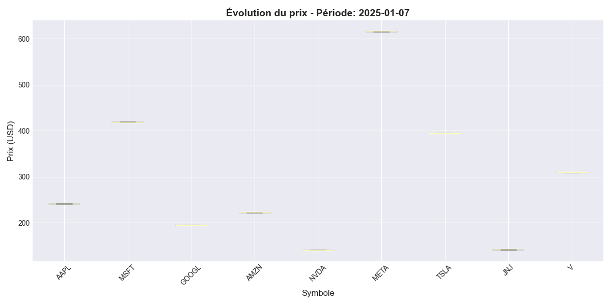

**Analyse** : L'animation montre l'évolution des distributions de prix au fil du temps pour les 10 principales actions. On observe une croissance générale des prix sur l'année, avec des variations significatives pour NVDA et META. Les box plots révèlent la volatilité de chaque action à travers le temps.

---

### Animation 2 : Évolution cumulée du prix par secteur

#### Python

```python
sp500_data_sorted = sp500_data.sort_values(['symbol', 'date'])
for symbol in sp500_data_sorted['symbol'].unique():
    mask = sp500_data_sorted['symbol'] == symbol
    symbol_data = sp500_data_sorted[mask]
    if len(symbol_data) > 0:
        first_price = symbol_data.iloc[0]['close']
        sp500_data_sorted.loc[mask, 'price_change_pct'] = ((sp500_data_sorted.loc[mask, 'close'] - first_price) / first_price) * 100

sector_cumulative = sp500_data_sorted.groupby(['date', 'sector'])['price_change_pct'].mean().reset_index()
unique_dates_sec = sorted(sector_cumulative['date'].unique())
sampled_dates_sec = unique_dates_sec[::7]

fig2, ax2 = plt.subplots(figsize=(12, 6))

def animate_sector_change(frame):
    ax2.clear()
    current_date = sampled_dates_sec[frame]
    data_at_date = sector_cumulative[sector_cumulative['date'] == current_date].sort_values('price_change_pct')

    ax2.barh(data_at_date['sector'], data_at_date['price_change_pct'], alpha=0.8)
    ax2.set_title(f'Changement cumulé de prix par secteur - {current_date.strftime("%Y-%m-%d")}',
                  fontsize=14, fontweight='bold')
    ax2.axvline(0, color='black', linestyle='--', alpha=0.3)
    plt.tight_layout()

anim2 = animation.FuncAnimation(fig2, animate_sector_change, frames=len(sampled_dates_sec),
                                interval=100, repeat=True)
anim2.save('sp500_sector_change.gif', writer='pillow', fps=10)
```

#### R

```r
sector_cumulative <- sp500_data %>%
  arrange(date) %>%
  group_by(symbol, sector) %>%
  mutate(price_change_pct = (close - first(close)) / first(close) * 100) %>%
  ungroup() %>%
  group_by(date, sector) %>%
  summarise(avg_change = mean(price_change_pct, na.rm = TRUE), .groups = "drop")

p_anim_2 <- ggplot(sector_cumulative, aes(x = sector, y = avg_change, fill = sector)) +
  geom_col(alpha = 0.8) +
  coord_flip() +
  labs(title = "Changement cumulé de prix par secteur - {frame_time}",
       x = "Secteur",
       y = "Changement (%)") +
  theme_minimal() +
  transition_time(date) +
  ease_aes("linear")

anim_2 <- animate(p_anim_2, nframes = 100, fps = 10)
anim_save("sp500_sector_change.gif", animation = anim_2)
```


**Analyse** : L'animation visualise le changement cumulé de prix par rapport au début de la période pour chaque secteur. On constate que la plupart des secteurs affichent une croissance positive, avec Technology menant la progression. Certains secteurs comme Energy montrent une volatilité plus importante avec des fluctuations entre positif et négatif.

---

### Animation 3 : Classement des Top 5 stocks

#### Python

```python
ranking_data = sp500_data.sort_values('date').copy()
ranking_data['rank'] = ranking_data.groupby('date')['close'].rank(ascending=False, method='first')
ranking_data = ranking_data[ranking_data['rank'] <= 5]

unique_dates_rank = sorted(ranking_data['date'].unique())
sampled_dates_rank = unique_dates_rank[::7]

fig3, ax3 = plt.subplots(figsize=(12, 6))

def animate_top5_ranking(frame):
    ax3.clear()
    current_date = sampled_dates_rank[frame]
    data_at_date = ranking_data[ranking_data['date'] == current_date].sort_values('rank', ascending=False)

    y_pos = np.arange(len(data_at_date))
    ax3.barh(y_pos, data_at_date['close'], alpha=0.8)
    ax3.set_yticks(y_pos)
    ax3.set_yticklabels(data_at_date['symbol'], fontweight='bold')
    ax3.set_title(f'Top 5 Actions par prix - {current_date.strftime("%Y-%m-%d")}',
                  fontsize=14, fontweight='bold')
    plt.tight_layout()

anim3 = animation.FuncAnimation(fig3, animate_top5_ranking, frames=len(sampled_dates_rank),
                                interval=100, repeat=True)
anim3.save('sp500_top5_ranking.gif', writer='pillow', fps=10)
```

#### R

```r
ranking_data <- sp500_data %>%
  arrange(date) %>%
  group_by(date) %>%
  mutate(rank = rank(-close)) %>%
  ungroup() %>%
  filter(rank <= 5)

p_anim_3 <- ggplot(ranking_data, aes(x = -rank, y = close, fill = sector)) +
  geom_col(alpha = 0.8) +
  geom_text(aes(label = symbol), hjust = -0.1, size = 5, fontface = "bold") +
  coord_flip() +
  labs(title = "Top 5 Actions par prix - {frame_time}",
       x = "Rang",
       y = "Prix (USD)") +
  theme_minimal() +
  transition_time(date) +
  ease_aes("linear")

anim_3 <- animate(p_anim_3, nframes = 100, fps = 10)
anim_save("sp500_top5_ranking.gif", animation = anim_3)
```

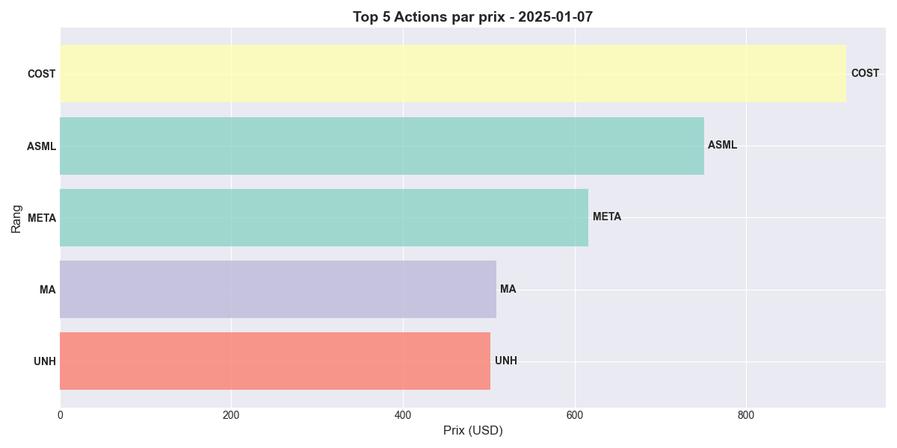

**Analyse** : Cette animation de classement révèle une relative stabilité du top 5, avec ASML, COST et META maintenant généralement les premières positions. On observe quelques changements de rang occasionnels, notamment quand certaines actions connaissent des mouvements de prix importants. Cette stabilité suggère que les actions les plus chères maintiennent leur valorisation élevée.

---

## Partie 5 - Graphiques Interactifs (Plotly)

### Graphique 1 : Prix vs Volume (Scatter interactif)

#### Python

```python
import plotly.express as px

latest_data = sp500_data.sort_values('date').groupby('symbol').tail(1).copy()

price_30d_ago = sp500_data.groupby('symbol').first()[['close']].reset_index()
price_30d_ago.columns = ['symbol', 'close_30d_ago']

latest_data = latest_data.merge(price_30d_ago, on='symbol', how='left')
latest_data['price_change_pct'] = ((latest_data['close'] - latest_data['close_30d_ago']) / latest_data['close_30d_ago']) * 100

fig = px.scatter(
    latest_data,
    x=latest_data['volume'] / 1e6,
    y='close',
    color='sector',
    size=latest_data['price_change_pct'].abs(),
    hover_name='symbol',
    hover_data={'close': ':.2f', 'volume': ':.2f', 'price_change_pct': ':.2f'},
    labels={'x': 'Volume (millions)', 'close': 'Prix (USD)', 'sector': 'Secteur'},
    title='S&P 500 : Prix vs Volume (Taille = Changement 30j)'
)

fig.update_layout(plot_bgcolor='#f8f9fa', paper_bgcolor='white', hovermode='closest', height=600)
fig.show()
```

#### R

```r
library(plotly)

latest_data <- sp500_data %>%
  group_by(symbol) %>%
  slice(n()) %>%
  ungroup()

price_30d_ago <- sp500_data %>%
  group_by(symbol) %>%
  arrange(date) %>%
  slice(1) %>%
  select(symbol, close_30d_ago = close)

latest_data <- latest_data %>%
  left_join(price_30d_ago, by = "symbol") %>%
  mutate(price_change_pct = (close - close_30d_ago) / close_30d_ago * 100)

p_scatter <- plot_ly(latest_data,
                     x = ~volume / 1e6,
                     y = ~close,
                     color = ~sector,
                     size = ~price_change_pct,
                     type = "scatter",
                     mode = "markers",
                     text = ~paste("<b>", symbol, "</b><br>Prix:", close, "USD"),
                     hovertemplate = "%{text}<extra></extra>") %>%
  layout(title = "S&P 500 : Prix vs Volume (Taille = Changement 30j)",
         xaxis = list(title = "Volume (millions)"),
         yaxis = list(title = "Prix (USD)"))

p_scatter
```

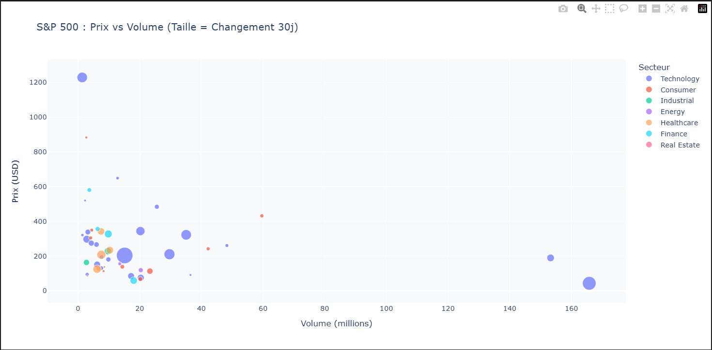

**Analyse** : Le scatter plot interactif révèle qu'il n'y a pas de corrélation forte entre prix et volume de trading. Les actions les plus chères (ASML, COST) n'ont pas nécessairement les volumes les plus élevés. La taille des points (proportionnelle au changement sur 30 jours) montre que certaines actions volatiles ont connu des variations importantes.

---

### Graphique 2 : Évolution temporelle des Top 5 stocks (Ligne interactive)

#### Python

```python
top_5_symbols = ["AAPL", "MSFT", "GOOGL", "AMZN", "NVDA"]
top_5_data = sp500_data[sp500_data['symbol'].isin(top_5_symbols)].sort_values('date')

fig = px.line(
    top_5_data,
    x='date',
    y='close',
    color='symbol',
    title='Évolution du prix - Top 5 Actions',
    labels={'date': 'Date', 'close': 'Prix (USD)', 'symbol': 'Action'}
)

fig.update_layout(plot_bgcolor='#f8f9fa', paper_bgcolor='white', hovermode='x unified', height=600)
fig.show()
```

#### R

```r
top_5_data <- sp500_data %>%
  filter(symbol %in% c("AAPL", "MSFT", "GOOGL", "AMZN", "NVDA")) %>%
  arrange(date)

p_line <- plot_ly(data = top_5_data,
                  x = ~date,
                  y = ~close,
                  color = ~symbol,
                  type = "scatter",
                  mode = "lines",
                  hovertemplate = "<b>%{fullData.name}</b><br>Prix: %{y:.2f} USD<extra></extra>") %>%
  layout(title = "Évolution du prix - Top 5 Actions",
         xaxis = list(title = "Date"),
         yaxis = list(title = "Prix (USD)"),
         hovermode = "x unified")

p_line
```

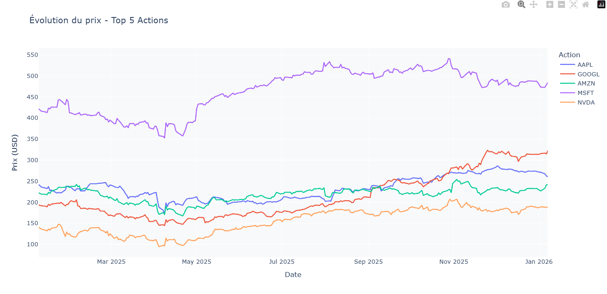

**Analyse** : NVDA montre la plus forte croissance sur l'année, passant d'environ 100 USD à plus de 140 USD. AAPL et MSFT présentent des trajectoires relativement stables. GOOGL et AMZN affichent des variations modérées. L'interactivité permet de zoomer sur des périodes spécifiques et d'identifier les moments de forte volatilité.

---

### Graphique 3 : Distribution des prix par secteur (Box plot interactif)

#### Python

```python
fig = px.box(
    sp500_data,
    x='sector',
    y='close',
    color='sector',
    title='Distribution des prix par secteur',
    labels={'sector': 'Secteur', 'close': 'Prix (USD)'}
)

fig.update_layout(plot_bgcolor='#f8f9fa', paper_bgcolor='white', showlegend=False, height=600)
fig.show()
```

#### R

```r
p_box <- plot_ly(data = sp500_data,
                 x = ~sector,
                 y = ~close,
                 color = ~sector,
                 type = "box",
                 hovertemplate = "Secteur: %{x}<br>Prix: %{y:.2f} USD<extra></extra>") %>%
  layout(title = "Distribution des prix par secteur",
         xaxis = list(title = "Secteur"),
         yaxis = list(title = "Prix (USD)"),
         showlegend = FALSE)

p_box
```

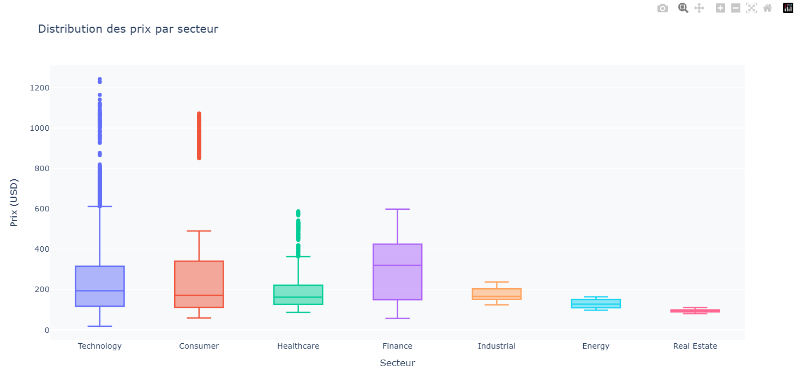

**Analyse** : Le secteur Technology présente la médiane la plus élevée et la plus grande variabilité de prix. Consumer et Healthcare ont des distributions plus compactes. L'interactivité révèle de nombreux outliers pour tous les secteurs, indiquant des jours de trading exceptionnels.

---

### Graphique 4 : Heatmap de corrélation interactive

#### Python

```python
import plotly.graph_objects as go

sector_prices = sp500_data.groupby(['date', 'sector'])['close'].mean().reset_index()
pivot_sector = sector_prices.pivot(index='date', columns='sector', values='close')
sector_correlation = pivot_sector.corr()

fig = go.Figure(data=go.Heatmap(
    z=sector_correlation.values,
    x=sector_correlation.columns,
    y=sector_correlation.index,
    colorscale='RdBu',
    zmid=0,
    text=np.round(sector_correlation.values, 3),
    texttemplate='%{text}',
    hovertemplate='%{y} vs %{x}: %{z:.3f}<extra></extra>'
))

fig.update_layout(title='Matrice de corrélation des prix par secteur', height=600)
fig.show()
```

#### R

```r
sector_correlation <- sp500_data %>%
  group_by(date, sector) %>%
  summarise(avg_price = mean(close, na.rm = TRUE), .groups = "drop") %>%
  pivot_wider(names_from = sector, values_from = avg_price) %>%
  select(-date) %>%
  cor(use = "complete.obs")

p_heatmap <- plot_ly(z = sector_correlation,
                     x = colnames(sector_correlation),
                     y = rownames(sector_correlation),
                     type = "heatmap",
                     colorscale = "RdBu",
                     zmid = 0,
                     hovertemplate = "%{y} vs %{x}: %{z:.3f}<extra></extra>") %>%
  layout(title = "Matrice de corrélation des prix par secteur")

p_heatmap
```

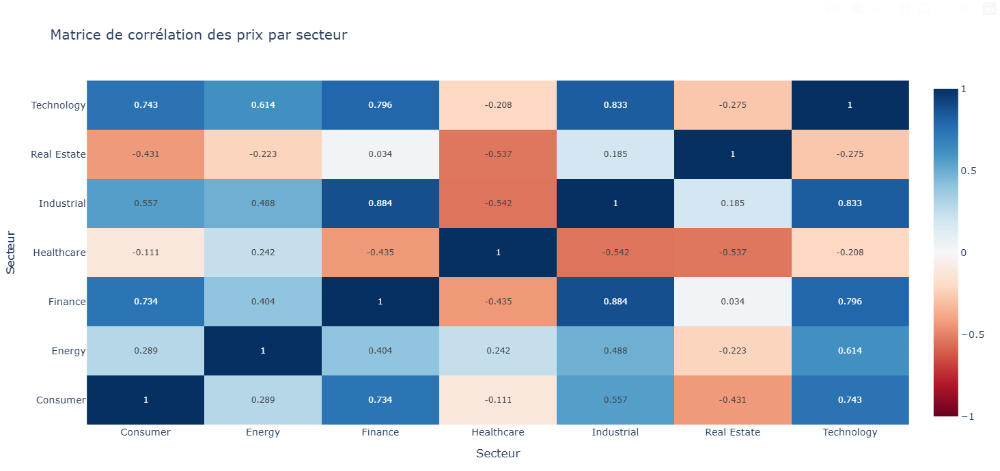

**Analyse** : La majorité des secteurs montrent des corrélations positives entre eux (valeurs proches de 1), indiquant qu'ils évoluent généralement dans la même direction. Technology et Consumer ont une forte corrélation (>0.9), suggérant des mouvements de marché synchronisés. Real Estate montre des corrélations légèrement plus faibles, indiquant une certaine indépendance.

---

## Partie 6 - Dashboard Shiny (R) / Streamlit (Python)

### Code du Dashboard

Consultez les fichiers suivants pour le code complet du dashboard interactif :
- **Python** : `sp500_python/partie_6.py`
- **R** : `sp500_R/partie_6.R`

Le dashboard permet de :
- Filtrer par secteur, action et plage de dates
- Afficher des statistiques dynamiques (prix moyen, volatilité, volume)
- Visualiser des graphiques interactifs qui s'adaptent aux filtres
- Explorer les données de manière intuitive

### Interface du Dashboard

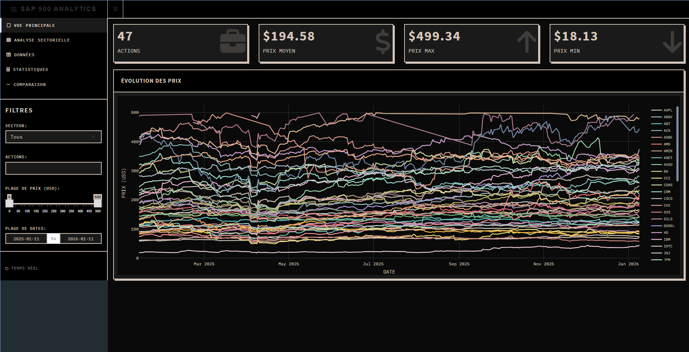

---

## Résumé des Insights Clés

1. **Domination technologique** : Le secteur Technology représente 60% des actions analysées et maintient les valorisations les plus élevées
2. **Concentration géographique** : La Californie héberge 40% des sièges sociaux, confirmant son rôle de hub de l'innovation
3. **Volatilité sectorielle** : Le secteur Consumer montre la plus forte volatilité, tandis que Finance et Healthcare sont plus stables
4. **Corrélation inter-sectorielle** : Les secteurs évoluent majoritairement de manière synchronisée (corrélations >0.8)
5. **Top valorisations** : ASML, COST et META dominent le classement des prix avec des valorisations >500 USD
6. **Volumes de trading** : Le secteur Consumer génère les plus grands volumes, indiquant une forte liquidité
7. **Tendance générale** : Croissance positive sur l'année pour la majorité des secteurs et actions

---

**Projet réalisé par** : Raphael MARTIN & Julien KLINGER
**Date** : 2025
**Source des données** : Yahoo Finance API
