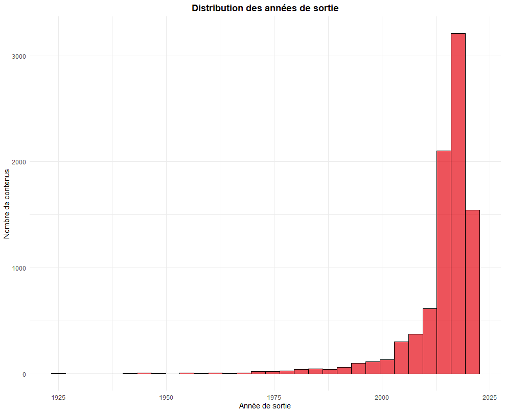
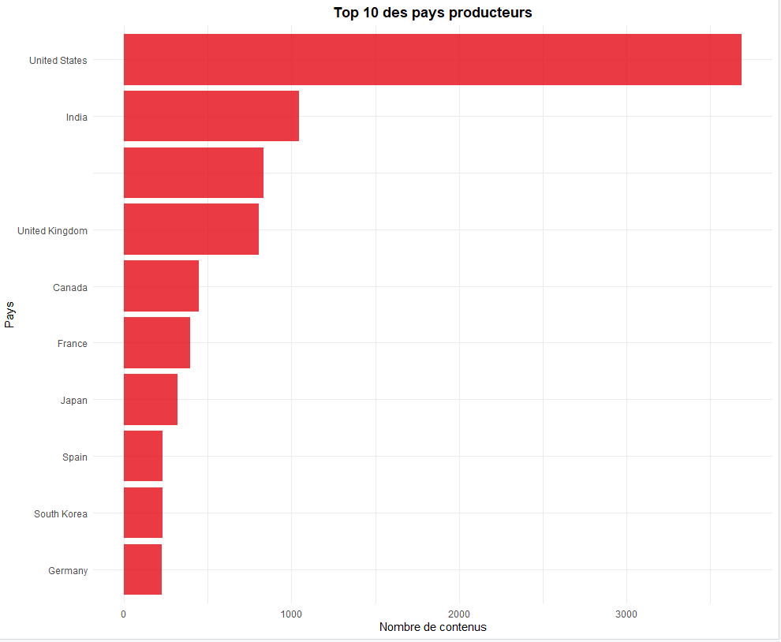
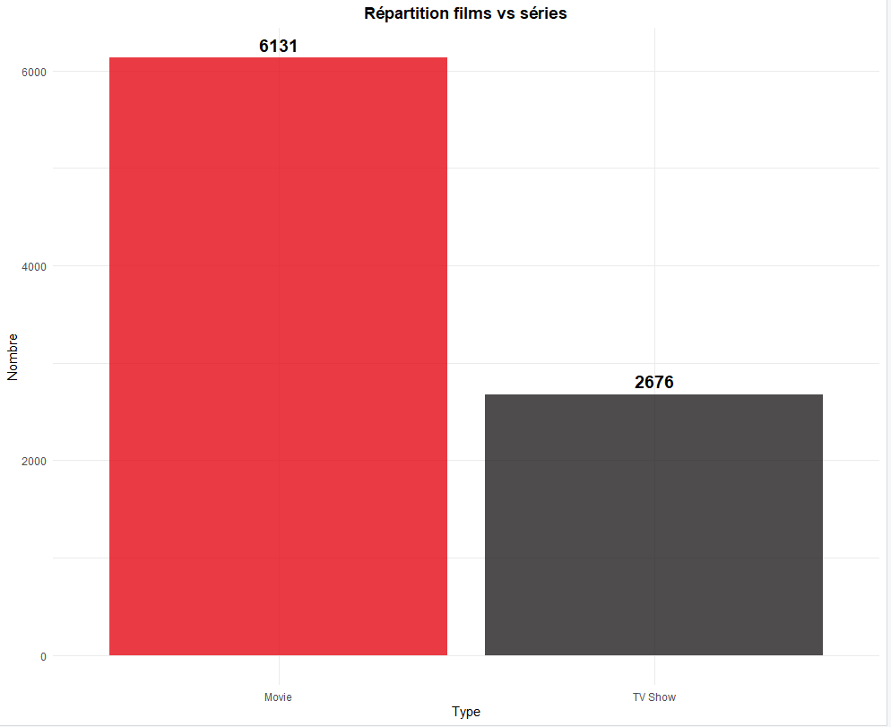
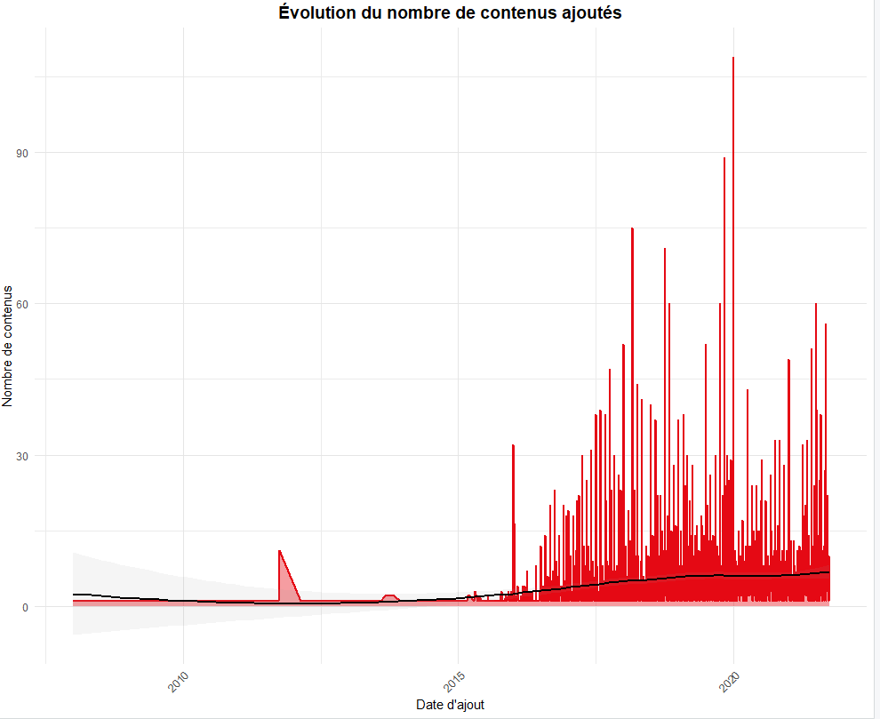
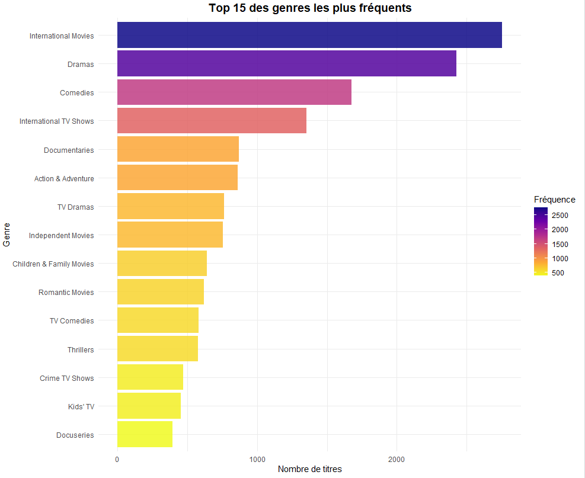
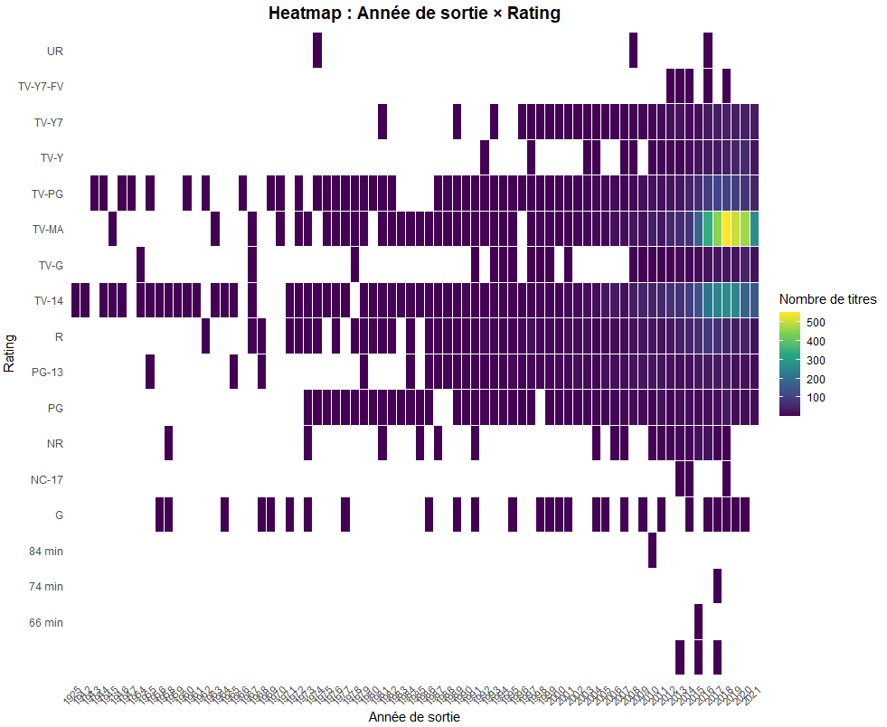
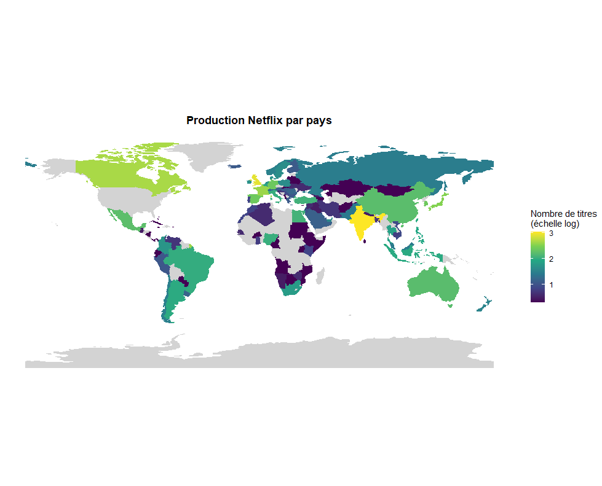
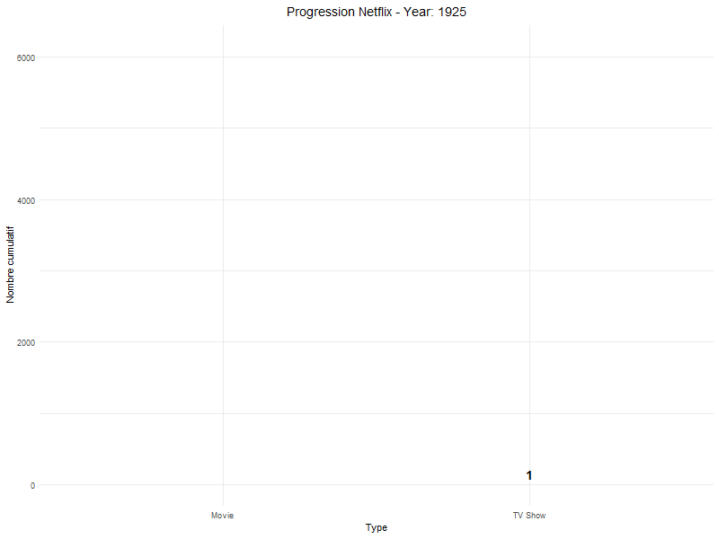
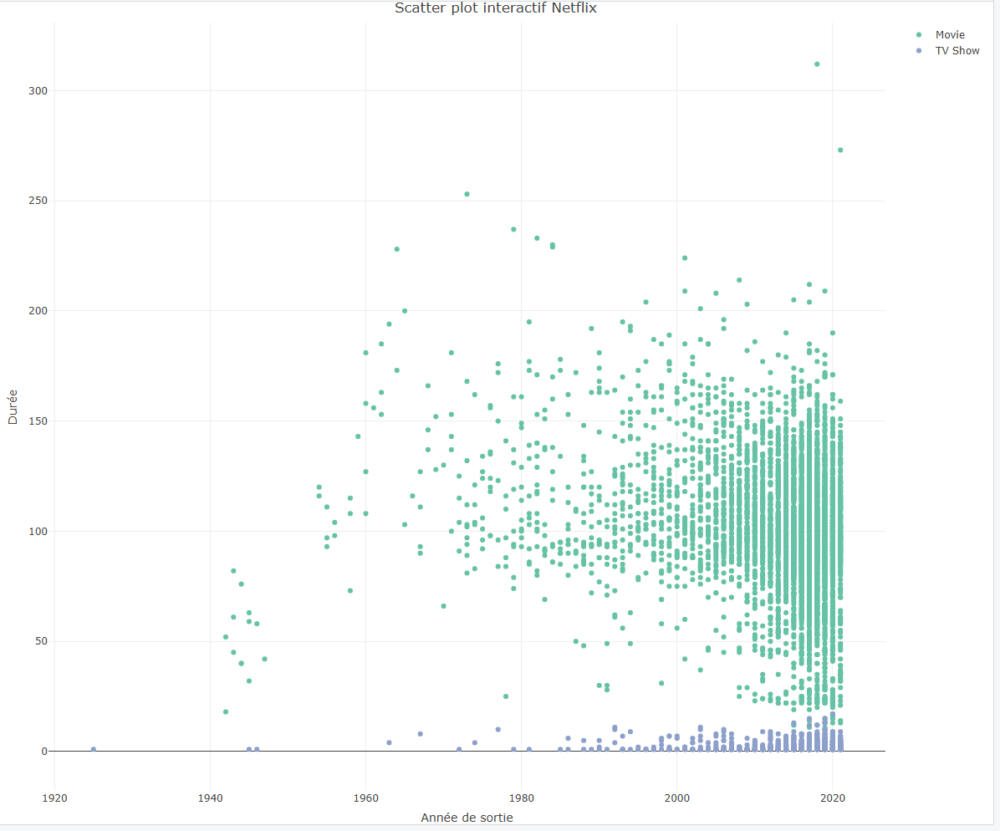
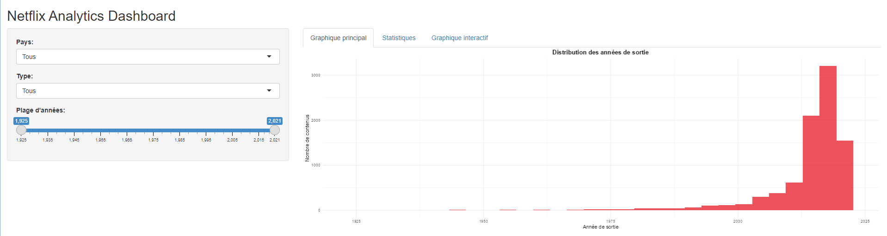

# TP6 - Dashboard avec R : Analyse Netflix

Analyse complète du catalogue Netflix avec visualisations avancées en R.

## Dataset

**Fichier** : `netflix_titles.csv`

## Partie 1 - Préparation et Exploration du Dataset

### Code

```r
library(tidyverse)
library(ggplot2)
library(plotly)
library(sf)
library(gganimate)

netflix <- read.csv("netflix_titles.csv")

head(netflix)
dim(netflix)
str(netflix)
summary(netflix)

netflix <- netflix %>%
  distinct() %>%
  mutate(
    date_added = as.Date(date_added, format = "%B %d, %Y"),
    release_year = as.numeric(release_year)
  ) %>%
  filter(!is.na(release_year))

glimpse(netflix)
```

### Graphique 1 : Distribution des années de sortie

```r
# Histogramme année de sortie
p1 <- ggplot(netflix, aes(x = release_year)) +
  geom_histogram(bins = 30, fill = "#E50914", color = "black", alpha = 0.7) +
  labs(title = "Distribution des années de sortie",
       x = "Année de sortie",
       y = "Nombre de contenus") +
  theme_minimal() +
  theme(plot.title = element_text(hjust = 0.5, face = "bold"))

print(p1)
```



**Analyse** : On observe une forte concentration des contenus produits entre 2015 et 2021, avec un pic très marqué autour de 2018-2019. Très peu de contenus datent d'avant 2000, ce qui reflète la stratégie de Netflix de privilégier les productions récentes.

---

### Graphique 2 : Top 10 des pays producteurs

```r
# Top 10 pays producteurs
netflix_countries <- netflix %>%
  separate_rows(country, sep = ", ") %>%
  filter(!is.na(country)) %>%
  group_by(country) %>%
  summarise(count = n(), .groups = "drop") %>%
  arrange(desc(count)) %>%
  head(10)

p2 <- ggplot(netflix_countries, aes(x = reorder(country, count), y = count)) +
  geom_col(fill = "#E50914", alpha = 0.8) +
  coord_flip() +
  labs(title = "Top 10 des pays producteurs",
       x = "Pays",
       y = "Nombre de contenus") +
  theme_minimal() +
  theme(plot.title = element_text(hjust = 0.5, face = "bold"))

print(p2)
```



**Analyse** : Les États-Unis dominent largement la production avec plus de 3000 contenus, suivi de loin par l'Inde et le Royaume-Uni. Cette répartition reflète la prédominance du marché américain dans l'industrie du streaming et l'expansion de Netflix en Inde.

---

### Graphique 3 : Répartition films vs séries

```r
# Répartition films vs séries
netflix_type <- netflix %>%
  group_by(type) %>%
  summarise(count = n(), .groups = "drop")

p3 <- ggplot(netflix_type, aes(x = type, y = count, fill = type)) +
  geom_col(alpha = 0.8) +
  geom_text(aes(label = count), vjust = -0.5, size = 5, fontface = "bold") +
  scale_fill_manual(values = c("Movie" = "#E50914", "TV Show" = "#221F1F")) +
  labs(title = "Répartition films vs séries",
       x = "Type",
       y = "Nombre") +
  theme_minimal() +
  theme(plot.title = element_text(hjust = 0.5, face = "bold"),
        legend.position = "none")

print(p3)
```



**Analyse** : Le catalogue Netflix contient environ 70% de films (6131) contre 30% de séries TV (2676). Les films restent donc la majorité du contenu disponible sur la plateforme.

---

## Partie 2 - Visualisations Avancées avec ggplot2

### Code

```r
library(tidyverse)
library(ggplot2)

netflix <- read.csv("netflix_titles.csv")

netflix <- netflix %>%
  distinct() %>%
  mutate(
    date_added = as.Date(date_added, format = "%B %d, %Y"),
    release_year = as.numeric(release_year)
  ) %>%
  filter(!is.na(release_year))
```

### Graphique 1 : Analyse temporelle - Évolution des contenus ajoutés

```r
# Analyse temporelle
netflix_timeline <- netflix %>%
  group_by(date_added) %>%
  summarise(count = n(), .groups = "drop") %>%
  filter(!is.na(date_added)) %>%
  arrange(date_added)

p_timeline <- ggplot(netflix_timeline, aes(x = date_added, y = count)) +
  geom_area(fill = "#E50914", alpha = 0.4) +
  geom_line(color = "#E50914", linewidth = 1) +
  geom_smooth(method = "loess", color = "black", se = TRUE, alpha = 0.1) +
  labs(title = "Évolution du nombre de contenus ajoutés",
       x = "Date d'ajout",
       y = "Nombre de contenus") +
  theme_minimal() +
  theme(plot.title = element_text(hjust = 0.5, face = "bold", size = 14),
        panel.grid.major = element_line(color = "grey90"),
        axis.text.x = element_text(angle = 45, hjust = 1))

print(p_timeline)
```



**Analyse** : On observe une croissance progressive des ajouts de contenu à partir de 2015, avec une accélération notable entre 2018 et 2020. Les pics correspondent aux périodes de lancement intensif de nouveaux contenus. La courbe lissée (en noir) montre une tendance générale à la hausse.

---

### Graphique 2 : Analyse des genres - Top 15

```r
# Analyse des genres
netflix_genres <- netflix %>%
  separate_rows(listed_in, sep = ", ") %>%
  filter(!is.na(listed_in)) %>%
  group_by(listed_in) %>%
  summarise(count = n(), .groups = "drop") %>%
  arrange(desc(count)) %>%
  head(15)

p_genres <- ggplot(netflix_genres, aes(x = reorder(listed_in, count), y = count, fill = count)) +
  geom_col(alpha = 0.85) +
  scale_fill_viridis_c(option = "plasma", direction = -1) +
  coord_flip() +
  labs(title = "Top 15 des genres les plus fréquents",
       x = "Genre",
       y = "Nombre de titres",
       fill = "Fréquence") +
  theme_minimal() +
  theme(plot.title = element_text(hjust = 0.5, face = "bold", size = 14),
        legend.position = "right")

print(p_genres)
```



**Analyse** : Les "International Movies" dominent largement avec plus de 2500 titres, suivis des "Dramas" et "Comedies". Cette diversité reflète la stratégie internationale de Netflix et l'importance du contenu dramatique et comique dans le catalogue.

---

### Graphique 3 : Heatmap multivariée (Année × Rating)

```r
# Heatmap multivariée
netflix_heatmap <- netflix %>%
  group_by(release_year, rating) %>%
  summarise(count = n(), .groups = "drop") %>%
  filter(!is.na(rating)) %>%
  arrange(release_year, rating)

p_heatmap <- ggplot(netflix_heatmap, aes(x = as.factor(release_year), y = rating, fill = count)) +
  geom_tile(color = "white", linewidth = 0.3) +
  scale_fill_viridis_c(option = "viridis", direction = 1) +
  labs(title = "Heatmap : Année de sortie × Rating",
       x = "Année de sortie",
       y = "Rating",
       fill = "Nombre de titres") +
  theme_minimal() +
  theme(plot.title = element_text(hjust = 0.5, face = "bold", size = 14),
        axis.text.x = element_text(angle = 45, hjust = 1, size = 8),
        panel.grid = element_blank())

print(p_heatmap)
```



**Analyse** : La heatmap révèle que les contenus TV-MA (mature), TV-14 et TV-PG sont les classifications les plus courantes, particulièrement pour les années récentes (2015-2021). Les zones jaunes indiquent une forte concentration de contenus TV-MA ces dernières années.

---

## Partie 3 - Cartographie

### Code

```r
library(tidyverse)
library(ggplot2)
library(sf)
library(rnaturalearth)

netflix <- read.csv("netflix_titles.csv")

netflix <- netflix %>%
  distinct() %>%
  mutate(
    date_added = as.Date(date_added, format = "%B %d, %Y"),
    release_year = as.numeric(release_year)
  ) %>%
  filter(!is.na(release_year))

netflix_by_country <- netflix %>%
  separate_rows(country, sep = ", ") %>%
  filter(!is.na(country)) %>%
  group_by(country) %>%
  summarise(count = n(), .groups = "drop")

world <- ne_countries(returnclass = "sf")

world_netflix <- world %>%
  left_join(netflix_by_country, by = c("name" = "country"))

p_map <- ggplot(world_netflix) +
  geom_sf(aes(fill = log10(count + 1)), color = NA) +
  scale_fill_viridis_c(option = "viridis", na.value = "lightgrey") +
  labs(title = "Production Netflix par pays",
       fill = "Nombre de titres\n(échelle log)") +
  theme_minimal() +
  theme(plot.title = element_text(hjust = 0.5, face = "bold"),
        axis.text = element_blank(),
        panel.grid = element_blank())

print(p_map)
```



**Analyse** : La carte mondiale montre clairement la prédominance de l'Amérique du Nord (États-Unis et Canada) en jaune vif. L'Inde, le Royaume-Uni et certains pays européens apparaissent également en teintes vertes à bleu foncé, indiquant une production significative. L'échelle logarithmique permet de mieux visualiser les disparités importantes entre les pays.

---

## Partie 4 - Animation

### Code

```r
library(tidyverse)
library(ggplot2)
library(gganimate)
library(gifski)

netflix <- read.csv("netflix_titles.csv")

netflix <- netflix %>%
  distinct() %>%
  mutate(
    date_added = as.Date(date_added, format = "%B %d, %Y"),
    release_year = as.numeric(release_year)
  ) %>%
  filter(!is.na(release_year))

netflix_yearly <- netflix %>%
  group_by(release_year, type) %>%
  summarise(count = n(), .groups = "drop") %>%
  arrange(release_year) %>%
  group_by(type) %>%
  mutate(cumulative = cumsum(count)) %>%
  ungroup()

p_anim <- ggplot(netflix_yearly, aes(x = type, y = cumulative, fill = type)) +
  geom_col(alpha = 0.8) +
  geom_text(aes(label = cumulative), vjust = -0.5, size = 5, fontface = "bold") +
  scale_fill_manual(values = c("Movie" = "#E50914", "TV Show" = "#221F1F")) +
  labs(title = "Progression Netflix - Year: {frame_time}",
       x = "Type",
       y = "Nombre cumulatif",
       fill = "Type") +
  theme_minimal() +
  theme(plot.title = element_text(hjust = 0.5, face = "bold", size = 14),
        legend.position = "none") +
  transition_time(release_year) +
  ease_aes("linear")

anim <- animate(p_anim, fps = 10, duration = 10, width = 800, height = 600, renderer = magick_renderer())
anim_save("netflix_animation.gif", animation = anim)
```



**Analyse** : L'animation montre la progression cumulative du nombre de films et séries TV au fil des années. On peut observer comment le catalogue s'est construit progressivement depuis 1925, avec une accélération importante à partir des années 2000. Les films (en rouge) ont toujours été majoritaires par rapport aux séries TV (en noir).

---

## Partie 5 - Visualisation Interactive

### Code

```r
library(tidyverse)
library(ggplot2)
library(plotly)

netflix <- read.csv("netflix_titles.csv")

netflix <- netflix %>%
  distinct() %>%
  mutate(
    date_added = as.Date(date_added, format = "%B %d, %Y"),
    release_year = as.numeric(release_year)
  ) %>%
  filter(!is.na(release_year))

netflix_scatter <- netflix %>%
  mutate(
    duration_numeric = case_when(
      type == "Movie" ~ as.numeric(gsub(" min", "", duration)),
      type == "TV Show" ~ as.numeric(gsub(" Seasons?", "", duration)),
      TRUE ~ NA_real_
    )
  ) %>%
  filter(!is.na(duration_numeric)) %>%
  select(title, director, country, release_year, duration_numeric, type)

p_scatter <- plot_ly(netflix_scatter,
                     x = ~release_year,
                     y = ~duration_numeric,
                     color = ~type,
                     text = ~paste("<b>", title, "</b><br>",
                                   "Réalisateur:", director, "<br>",
                                   "Pays:", country),
                     mode = "markers",
                     type = "scatter",
                     hovertemplate = "%{text}<extra></extra>") %>%
  layout(title = "Scatter plot interactif Netflix",
         xaxis = list(title = "Année de sortie"),
         yaxis = list(title = "Durée"),
         hovermode = "closest")

p_scatter
```



**Analyse** : Le scatter plot révèle deux groupes distincts : les films (en vert) avec des durées concentrées entre 80 et 150 minutes, et les séries TV (en bleu) avec principalement 1 à 5 saisons. On observe une densité croissante de points pour les années 2000-2020, confirmant l'expansion récente du catalogue. La plupart des films récents ont une durée standard autour de 90-120 minutes.

---

## Partie 6 - Mini-Dashboard Shiny

### Code

```r
library(shiny)
library(tidyverse)
library(ggplot2)
library(plotly)

netflix <- read.csv("netflix_titles.csv")

netflix <- netflix %>%
  distinct() %>%
  mutate(
    date_added = as.Date(date_added, format = "%B %d, %Y"),
    release_year = as.numeric(release_year)
  ) %>%
  filter(!is.na(release_year))

netflix_scatter_prep <- netflix %>%
  mutate(
    duration_numeric = case_when(
      type == "Movie" ~ as.numeric(gsub(" min", "", duration)),
      type == "TV Show" ~ as.numeric(gsub(" Seasons?", "", duration)),
      TRUE ~ NA_real_
    )
  ) %>%
  filter(!is.na(duration_numeric))

ui <- fluidPage(
  titlePanel("Netflix Analytics Dashboard"),

  sidebarLayout(
    sidebarPanel(
      selectInput("country_filter", "Pays:",
                  choices = c("Tous", unique(na.omit(unlist(strsplit(netflix$country, ", ")))))),
      selectInput("type_filter", "Type:",
                  choices = c("Tous", unique(netflix$type))),
      sliderInput("year_filter", "Plage d'années:",
                  min = min(netflix$release_year, na.rm = TRUE),
                  max = max(netflix$release_year, na.rm = TRUE),
                  value = c(min(netflix$release_year, na.rm = TRUE),
                           max(netflix$release_year, na.rm = TRUE)))
    ),

    mainPanel(
      tabsetPanel(
        tabPanel("Graphique principal",
                 plotOutput("histogram_plot")),
        tabPanel("Statistiques",
                 h3("Statistiques filtrées"),
                 textOutput("total_movies"),
                 textOutput("total_series"),
                 textOutput("avg_genres")),
        tabPanel("Graphique interactif",
                 plotlyOutput("scatter_plot"))
      )
    )
  )
)

server <- function(input, output) {

  filtered_data <- reactive({
    data <- netflix

    if (input$country_filter != "Tous") {
      data <- data %>%
        filter(grepl(input$country_filter, country, ignore.case = TRUE))
    }

    if (input$type_filter != "Tous") {
      data <- data %>%
        filter(type == input$type_filter)
    }

    data <- data %>%
      filter(release_year >= input$year_filter[1],
             release_year <= input$year_filter[2])

    return(data)
  })

  output$histogram_plot <- renderPlot({
    ggplot(filtered_data(), aes(x = release_year)) +
      geom_histogram(bins = 30, fill = "#E50914", alpha = 0.7) +
      labs(title = "Distribution des années de sortie",
           x = "Année de sortie",
           y = "Nombre de contenus") +
      theme_minimal() +
      theme(plot.title = element_text(hjust = 0.5, face = "bold"))
  })

  output$total_movies <- renderText({
    count <- filtered_data() %>% filter(type == "Movie") %>% nrow()
    paste("Nombre total de films:", count)
  })

  output$total_series <- renderText({
    count <- filtered_data() %>% filter(type == "TV Show") %>% nrow()
    paste("Nombre de séries:", count)
  })

  output$avg_genres <- renderText({
    avg <- filtered_data() %>%
      mutate(num_genres = sapply(strsplit(listed_in, ", "), length)) %>%
      summarise(avg = mean(num_genres, na.rm = TRUE)) %>%
      pull(avg)
    paste("Nombre moyen de genres différents:", round(avg, 2))
  })

  output$scatter_plot <- renderPlotly({
    scatter_data <- filtered_data() %>%
      mutate(
        duration_numeric = case_when(
          type == "Movie" ~ as.numeric(gsub(" min", "", duration)),
          type == "TV Show" ~ as.numeric(gsub(" Seasons?", "", duration)),
          TRUE ~ NA_real_
        )
      ) %>%
      filter(!is.na(duration_numeric))

    plot_ly(scatter_data,
            x = ~release_year,
            y = ~duration_numeric,
            color = ~type,
            text = ~paste("<b>", title, "</b><br>",
                         "Réalisateur:", director, "<br>",
                         "Pays:", country),
            mode = "markers",
            type = "scatter",
            hovertemplate = "%{text}<extra></extra>") %>%
      layout(title = "Scatter plot dynamique",
             xaxis = list(title = "Année de sortie"),
             yaxis = list(title = "Durée"),
             hovermode = "closest")
  })
}

shinyApp(ui = ui, server = server)
```

**Pour lancer le dashboard** :
```r
shiny::runApp("partie_6.R")
```



**Analyse** : Le dashboard interactif permet de filtrer les données par pays, type de contenu et plage d'années. Il comprend trois onglets :
1. **Graphique principal** : Histogramme des années de sortie filtré
2. **Statistiques** : Affiche le nombre de films, séries et genres moyens selon les filtres
3. **Graphique interactif** : Scatter plot dynamique avec hover pour explorer les contenus individuellement
